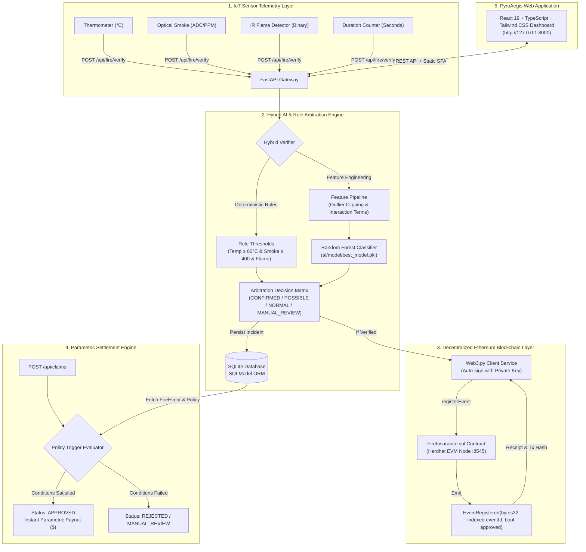

<div align="center">

# 🔥 PyroAegis
### Autonomous Parametric Fire Insurance & Blockchain Settlement Protocol

[](https://www.python.org/)
[](https://fastapi.tiangolo.com/)
[](https://react.dev/)
[](https://www.typescriptlang.org/)
[](https://soliditylang.org/)
[](https://hardhat.org/)
[](https://web3py.readthedocs.io/)
[](https://scikit-learn.org/)
[](https://tailwindcss.com/)
[](#running-automated-tests)
[](https://opensource.org/licenses/MIT)

<p align="center">
  <b>A zero-touch, fraud-resistant parametric insurance protocol that unifies real-time IoT hardware telemetry, dual-layer AI arbitration, and Ethereum smart contracts for instantaneous claim verification and indemnity disbursement.</b>
</p>

[Explore Features](#-key-features) •
[Architecture](#-system-architecture) •
[Quickstart Guide](#-quickstart-step-by-step-guide) •
[Frontend UI](#-interactive-frontend-dashboard) •
[API Reference](#-complete-api-reference) •
[Testing](#-running-automated-tests)

</div>

---

## 📖 Executive Summary

Traditional indemnity fire insurance is plagued by slow operational friction:
- **Lengthy Settlement Windows**: Policyholders frequently wait 30 to 90 days for on-site loss adjusters.
- **Subjective Claims Assessment**: Ambiguity in damage reports leads to disputed payouts and legal overhead.
- **Fraud & Tampering Vulnerability**: Manual paper claims are susceptible to post-incident fabrication.

**PyroAegis** replaces subjective claims processing with an **autonomous parametric protocol**:
1. **IoT Telemetry Ingestion**: Continuous monitoring of ambient temperature, optical smoke density, flame presence, and event duration.
2. **Dual-Layer Hybrid Arbitration**: Deterministic engineering thresholds validated against an ensemble **Random Forest Classifier** ($F_1\text{ Macro} = 98.50\%$) to reject sensor glitches, kitchen cooking smoke, and deliberate tampering.
3. **Decentralized On-Chain Oracle**: Confirmed incidents are cryptographically signed and stored in the **Ethereum `FireInsurance.sol` smart contract** using `keccak256` content hashing.
4. **Instant Parametric Liquidity**: Pre-underwritten policy triggers automatically disburse indemnities within seconds once on-chain event criteria are satisfied.

---

## ✨ Key Features

- 🛰️ **IoT Telemetry Pipeline**: Ingests multi-sensor arrays (thermocouples, optical smoke detectors, and infrared flame optical sensors) with temporal duration tracking.
- 🧠 **Anti-Tampering AI Engine**: Pre-trained Scikit-Learn pipeline using Polynomial feature interactions (`temp_smoke_interaction`, `is_high_risk`) to identify physical heating without actual combustion.
- ⛓️ **Hardhat EVM Integration**: Deploys native Solidity contracts (`0.8.24`) on local or testnet nodes, extracting cryptographic event logs (`EventRegistered`) via Web3.py.
- ⚡ **Zero-Touch Parametric Claims**: Algorithmic policy matching comparing sensor telemetry directly against policy limits for immediate payout authorization.
- 🖥️ **Professional Cyber-Slate Web Dashboard**: React 19 + TypeScript + Tailwind CSS UI featuring a live sensor simulation board, policy manager, claims execution hub, smart contract explorer, and AI explainability analytics.
- 🛡️ **Full Local Self-Sufficiency**: Runs 100% locally with Hardhat node, SQLite/SQLModel persistence, and embedded frontend delivery from a single FastAPI process.

---

## 🏗️ System Architecture



---

## 📁 Project Directory Structure

```
├── contracts/
│   └── FireInsurance.sol          # Solidity 0.8.24 Smart Contract (Parametric Policy & Event Ledger)
├── scripts/
│   └── deploy_fire_contract.js    # Hardhat ethers.js contract deployment script
├── backend/
│   ├── app.py                     # FastAPI entry point, CORS middleware & embedded SPA delivery
│   ├── config.py                  # Pydantic Settings reading .env configurations
│   ├── models/
│   │   ├── db.py                  # SQLite database engine & session dependency injection
│   │   ├── sensor_data.py         # Pydantic telemetry input schemas
│   │   └── tables.py              # SQLModel table definitions (FireEvent, Policy, Claim)
│   ├── routes/
│   │   ├── sensor_routes.py       # Raw IoT telemetry ingestion endpoints
│   │   ├── fire_routes.py         # Fire verification & blockchain registration routes
│   │   └── claim_routes.py        # Parametric policy and claim evaluation CRUD routes
│   ├── services/
│   │   ├── blockchain_service.py  # Web3.py client, transaction signing & receipt decoding
│   │   ├── fire_detection.py      # Deterministic rule-based threshold check
│   │   └── verification_service.py# Hybrid Rule + AI arbitration decision matrix
│   ├── storage/
│   │   └── database.db            # SQLite database file
│   └── tests/
│       ├── test_claims.py         # Pytest test suite for policies & claim evaluation
│       └── test_fire_verify.py    # Pytest test suite for sensor ingestion & blockchain verification
├── ai/
│   ├── inference/
│   │   └── ai_service.py          # Artifact loader & real-time inference scoring pipeline
│   ├── model/
│   │   ├── best_model.pkl         # Production Random Forest Classifier model
│   │   ├── preprocessing_pipeline.pkl # Scikit-Learn ColumnTransformer pipeline
│   │   └── model_metadata.json    # Model hyperparameters and evaluation metrics
│   ├── preprocessing/
│   │   └── pipeline.py            # Feature engineering, cleaning & scaling
│   ├── training/
│   │   ├── config.yaml            # Hyperparameter search space & CV configuration
│   │   └── train.py               # MLflow-tracked training & GridSearchCV optimization
│   └── tests/
│       └── test_ai_service.py     # Unit tests verifying edge-case classification
├── data/
│   └── raw/
│       └── fire_sensor_training_data.csv # 5,000+ labeled IoT sensor readings
├── frontend/                      # PyroAegis React Web Dashboard
│   ├── src/
│   │   ├── components/
│   │   │   ├── Navbar.tsx         # Responsive header with live EVM & AI health indicators
│   │   │   ├── DashboardView.tsx  # Executive overview, KPI stat cards & pipeline diagrams
│   │   │   ├── TelemetrySimulatorView.tsx # Interactive hardware sliders & 1-click test presets
│   │   │   ├── PoliciesView.tsx   # Parametric insurance policy registry & creation modal
│   │   │   ├── ClaimsView.tsx     # Pre-flight condition evaluator & claims ledger
│   │   │   ├── BlockchainLedgerView.tsx # On-chain event inspector & smart contract ABI viewer
│   │   │   └── AIModelView.tsx    # ML explainability, features & decision matrix
│   │   ├── services/
│   │   │   └── api.ts             # Fetch API client interfacing with backend routes
│   │   ├── types/
│   │   │   └── index.ts           # Comprehensive TypeScript interfaces
│   │   ├── App.tsx                # Main SPA routing & global state
│   │   └── index.css              # Custom Tailwind CSS styling & animations
│   ├── vite.config.ts             # Vite configuration with Tailwind plugin & backend proxy
│   └── package.json               # Frontend dependencies (React 19, Lucide, Tailwind)
├── hardhat.config.ts              # Hardhat configuration (Solidity 0.8.24 & local network)
├── package.json                   # Root package with Hardhat and frontend build scripts
├── requirements.txt               # Complete Python package dependencies
└── .env                           # Environment configuration
```

---

## ⚙️ Hybrid AI & Arbitration Logic

To prevent both false alarms (e.g. harmless kitchen cooking smoke or elevated summer heat) and malicious fraud (e.g. holding a lighter directly against a thermometer), PyroAegis enforces a **dual-layer decision matrix**:

| Rule Engine Verdict | AI Classification | Final Verification Status | Settlement Action |
|:---|:---|:---|:---|
| `CONFIRMED_FIRE` | `CONFIRMED_FIRE` or `POSSIBLE_FIRE` | **`CONFIRMED_FIRE`** | ✅ Mined on Ethereum $\rightarrow$ Instant Claim Approval |
| `POSSIBLE_FIRE` | `CONFIRMED_FIRE` | **`CONFIRMED_FIRE`** | ✅ AI upgraded borderline case $\rightarrow$ Instant Claim Approval |
| `POSSIBLE_FIRE` | `POSSIBLE_FIRE` | **`POSSIBLE_FIRE`** | ⚠️ On-Chain Logged $\rightarrow$ Eligible for Automated Review |
| `NORMAL` | `NORMAL` | **`NORMAL`** | 🛑 Ambient conditions $\rightarrow$ No claim action |
| *Contradiction / Outlier* | *Disagreement* | **`MANUAL_REVIEW`** | 🔍 Sensor fault flagged $\rightarrow$ Claim routed for inspector review |

---

## 💻 Interactive Frontend Dashboard

The **PyroAegis** frontend provides a command center for insurance administrators, claims assessors, and smart contract auditors:

- **Executive KPI Dashboard**: Live tracker of active policies, verified fire incidents, total claims settled, approval rate %, and total disbursed indemnity.
- **Interactive IoT Telemetry Simulator**:
  - Live sliders for temperature ($-20^\circ\text{C}$ to $150^\circ\text{C}$), optical smoke density ($0$ to $1023\text{ PPM}$), and sustained exposure duration.
  - Optical IR flame toggle switch.
  - **1-Click Test Scenarios**: Safe Ambient Office, Kitchen Smoke, Overheated Radiator, Structural Blaze, and Sensor Glitch.
  - **Live Blockchain Proof**: Displays transaction hash (`tx_hash`) and smart contract event ID (`keccak256`) directly with copy-to-clipboard.
- **Parametric Underwriting Registry**: Create custom insurance policies with specific temperature/smoke thresholds and indemnity amounts, or use pre-configured industrial templates (*High-Risk Chemical Storage*, *Commercial Enterprise*, *Residential Condominium*).
- **Automated Claims Evaluation Hub**: 1-click condition evaluator verifying that the fire event was oracle-verified, temperature threshold was exceeded, smoke density was satisfied, and optical flames were detected.
- **Smart Contract & ABI Inspector**: Real-time explorer of on-chain mined events, gas fees, block numbers, and Solidity ABI functions (`registerEvent`, `getEvent`).
- **AI Diagnostics & Feature Explainability**: Detailed breakdown of Random Forest hyperparameters, $F_1$ score metrics, and engineered polynomial features.

---

## 📋 Prerequisites

Ensure your system meets the following prerequisites:
- **Node.js**: v18.0.0 or higher (`node -v`)
- **npm**: v9.0.0 or higher (`npm -v`)
- **Python**: v3.10 to v3.12 (`python --version`)
- **Git**

---

## 🚀 Quickstart: Step-by-Step Guide

Follow these steps to run the complete system locally.

### 1. Clone & Setup Workspace
```bash
git clone https://github.com/Priyankush123/Blockchain-Based-Automated-Fire-Insurance-Claim-System.git
cd Blockchain-Based-Automated-Fire-Insurance-Claim-System
```

### 2. Configure Python Virtual Environment
```bash
# Create Python virtual environment
python -m venv venv

# Activate Virtual Environment:
# On Windows (PowerShell):
.\venv\Scripts\Activate.ps1
# On Windows (CMD):
.\venv\Scripts\activate.bat
# On Linux/macOS:
source venv/bin/activate

# Install all backend, AI, and blockchain dependencies
pip install -r requirements.txt
```

### 3. Install Node & Frontend Dependencies
```bash
# Install root Hardhat & smart contract tools
npm install

# Install frontend React dependencies
npm run frontend:install

# Compile the production React build (embedded into FastAPI)
npm run frontend:build
```

### 4. Start the Local Ethereum Blockchain
In **Terminal 1**, start the local Hardhat EVM node:
```bash
npx hardhat node
```
*Keep this terminal open.* Hardhat launches a local JSON-RPC server at `http://127.0.0.1:8545` with 20 pre-funded test accounts (10,000 ETH each).

### 5. Deploy the Smart Contract
In **Terminal 2**, compile and deploy the `FireInsurance.sol` contract:
```bash
npx hardhat run scripts/deploy_fire_contract.js --network local
```
**Expected Output:**
```text
✅ FireInsurance deployed to: 0x5FbDB2315678afecb367f032d93F642f64180aa3
👉 Copy this address into your .env as FI_CONTRACT_ADDRESS
```

### 6. Verify Environment Configuration (`.env`)
Ensure your `.env` in the project root matches the deployed contract:
```env
# Blockchain settings
WEB3_RPC_URL=http://127.0.0.1:8545
FI_CONTRACT_ADDRESS=0x5FbDB2315678afecb367f032d93F642f64180aa3
FI_PRIVATE_KEY=0xac0974bec39a17e36ba4a6b4d238ff944bacb478cbed5efcae784d7bf4f2ff80

# AI model paths
MODEL_PATH=ai/model/best_model.pkl
PREPROCESSOR_PATH=ai/model/preprocessing_pipeline.pkl
METADATA_PATH=ai/model/model_metadata.json

# Verification thresholds
TEMPERATURE_THRESHOLD=60.0
SMOKE_THRESHOLD=400
REQUIRED_DURATION_SECONDS=5
```

### 7. Launch the Application (Backend + Frontend)
In **Terminal 2**, start the FastAPI server:
```bash
uvicorn backend.app:app --reload --host 127.0.0.1 --port 8000
```

🎉 **Access the Application**:
- 🌐 **PyroAegis Web Dashboard**: [http://127.0.0.1:8000/](http://127.0.0.1:8000/)
- 📑 **Interactive Swagger API Docs**: [http://127.0.0.1:8000/docs](http://127.0.0.1:8000/docs)
- 📑 **Redoc OpenAPI Specification**: [http://127.0.0.1:8000/redoc](http://127.0.0.1:8000/redoc)

### 8. (Optional) Run Frontend in Standalone Dev Mode
If you wish to modify the React frontend with instant Hot-Module-Reloading (HMR):
```bash
npm run frontend:dev
```
- Dev Server runs at: [http://127.0.0.1:5173/](http://127.0.0.1:5173/) (proxies API requests to port 8000).

---

## 🧪 Running Automated Tests

The repository includes a comprehensive, automated test suite covering unit, integration, and blockchain interaction layers.

```bash
# Run backend API, database, and smart contract integration tests
pytest backend/tests -v
```
*Expected: 15 passed in ~4.5 seconds.*

```bash
# Run AI model classification and edge-case unit tests
python -m unittest ai/tests/test_ai_service.py -v
```
*Expected: 6 passed in ~1.5 seconds.*

**Combined Test Results: 21 / 21 Tests Passing (100% Pass Rate).**

---

## 🔄 End-to-End Execution Walkthrough

You can test the entire lifecycle via the **Web UI** or via **CLI / cURL**:

### Option A: Via the Web Dashboard
1. Open [http://127.0.0.1:8000/](http://127.0.0.1:8000/).
2. Navigate to **Policies** and verify or create a policy (e.g. Temp $\ge 60^\circ\text{C}$, Smoke $\ge 400$, Payout $\$100,000$).
3. Navigate to **IoT Telemetry & Simulator**, select the **"Major Structural Blaze"** preset ($95^\circ\text{C}$, $880\text{ PPM}$, Flame Active), and click **"Transmit Telemetry & Verify Incident"**.
4. Observe the **CONFIRMED_FIRE** verdict and the newly mined Ethereum transaction hash and event ID.
5. Click **"Evaluate Claim for This Fire Event"**, confirm the 4 pre-flight checks, and click **"Execute Claim Evaluation"**.
6. View the instantaneous **APPROVED** status and $\$100,000$ payout in the settlement ledger!

---

### Option B: Via Command-Line / cURL

#### 1. Check System Health
```bash
curl -X GET http://127.0.0.1:8000/health
```
```json
{"status": "ok", "model_loaded": true}
```

#### 2. Create an Insurance Policy
```bash
curl -X POST http://127.0.0.1:8000/api/policies \
     -H "Content-Type: application/json" \
     -d '{
       "temperature_threshold": 60.0,
       "smoke_threshold": 400,
       "required_duration_seconds": 5,
       "payout_amount": 100000.0
     }'
```
*(Copy the generated policy `id`)*

#### 3. Ingest Fire Telemetry & Register On-Chain
```bash
curl -X POST http://127.0.0.1:8000/api/fire/verify \
     -H "Content-Type: application/json" \
     -d '{
       "device_id": "ESP32_WAREHOUSE_01",
       "property_id": "PROP_SECTOR_4",
       "temperature": 94.0,
       "smoke_level": 820,
       "flame_detected": true,
       "timestamp": "2026-09-30T10:00:00"
     }'
```
```json
{
  "verification": {
    "rule_verdict": "CONFIRMED_FIRE",
    "ai_result": { "fire_confidence": 1.0, "classification": "CONFIRMED_FIRE" },
    "verification_status": "CONFIRMED_FIRE",
    "reason": "Rule engine and AI both strongly indicate fire."
  },
  "verification_status": "CONFIRMED_FIRE",
  "fire_event_id": "4b684cb322744837a2e21297e6515d18",
  "blockchain": {
    "tx_hash": "0x70980c3475480854747e1e2b3bbe8abe63957b8ae4a7d9d1dbf3288b2270ad78",
    "event_id": "0x77fcb5a0f8f7701eae3b26a2d1c3e15f77c91656e202035ca5064810031306d1",
    "receipt": { "status": 1, "gasUsed": 164210 }
  }
}
```

#### 4. Evaluate & Settle the Claim
```bash
curl -X POST http://127.0.0.1:8000/api/claims \
     -H "Content-Type: application/json" \
     -d '{
       "event_id": "<fire_event_id>",
       "policy_id": "<policy_id>"
     }'
```
```json
{
  "id": "787fe155a0244485a37e5d8ff867bebc",
  "event_id": "4b684cb322744837a2e21297e6515d18",
  "policy_id": "67dae08f8bb14c778434a905a9686036",
  "status": "approved",
  "payout_amount": 100000.0,
  "created_at": "2026-09-30T10:05:00",
  "updated_at": "2026-09-30T10:05:00"
}
```

---

## 📡 Complete API Reference

| HTTP Method | Endpoint Path | Description | Request Body | Response Codes |
|:---|:---|:---|:---|:---|
| `GET` | `/health` | Verify system health & model status | None | `200` |
| `GET` | `/api/model/info` | Fetch ML metadata & hyperparameters | None | `200`, `500` |
| `POST` | `/api/sensors/data` | Ingest raw sensor reading | `SensorData` JSON | `201`, `422` |
| `POST` | `/api/fire/verify` | Hybrid verification + Blockchain register | `SensorData` JSON | `200`, `500` |
| `GET` | `/api/fire/events` | List all historical fire incidents | None | `200` |
| `GET` | `/api/fire/events/{id}` | Get specific fire incident details | None | `200`, `404` |
| `POST` | `/api/policies` | Create a new parametric policy | `PolicyCreate` JSON | `201`, `422` |
| `GET` | `/api/policies` | List all active policies | None | `200` |
| `GET` | `/api/policies/{id}` | Get specific policy terms | None | `200`, `404` |
| `DELETE`| `/api/policies/{id}` | Remove a policy contract | None | `204`, `404` |
| `POST` | `/api/claims` | Evaluate event against policy for payout | `ClaimCreate` JSON | `201`, `404` |
| `GET` | `/api/claims` | List all evaluated claims | None | `200` |
| `GET` | `/api/claims/{id}` | Get claim status & payout receipt | None | `200`, `404` |

---

## 📜 Smart Contract Reference (`FireInsurance.sol`)

The `FireInsurance.sol` contract deployed on Ethereum / EVM:

```solidity
// SPDX-License-Identifier: MIT
pragma solidity ^0.8.24;

contract FireInsurance {
    struct Event {
        uint256 timestamp;
        string deviceId;
        string propertyId;
        int256 temperature;
        uint256 smokeLevel;
        bool flameDetected;
        bool verified;
    }

    mapping(bytes32 => Event) public events;
    event EventRegistered(bytes32 indexed eventId, bool approved);

    function registerEvent(
        string memory deviceId,
        string memory propertyId,
        int256 temperature,
        uint256 smokeLevel,
        bool flameDetected,
        bool verified
    ) external returns (bytes32) {
        uint256 ts = block.timestamp;
        bytes32 id = keccak256(abi.encodePacked(deviceId, ts));
        events[id] = Event({
            timestamp: ts,
            deviceId: deviceId,
            propertyId: propertyId,
            temperature: temperature,
            smokeLevel: smokeLevel,
            flameDetected: flameDetected,
            verified: verified
        });
        emit EventRegistered(id, verified);
        return id;
    }

    function getEvent(bytes32 id) external view returns (Event memory) {
        return events[id];
    }
}
```

---

## 🛠️ Troubleshooting & FAQ

<details>
<summary><b>1. Port 8545 or 8000 already in use (EADDRINUSE / WinError 10048)</b></summary>

If a previous Hardhat node or Uvicorn process is still running:
- **Windows (PowerShell)**:
  ```powershell
  # Find PID using port 8545 or 8000
  Get-NetTCPConnection -LocalPort 8545 -ErrorAction SilentlyContinue | Select-Object -Property OwningProcess
  # Stop the process
  Stop-Process -Id <PID> -Force
  ```
- **Linux / macOS**:
  ```bash
  kill -9 $(lsof -t -i:8545)
  kill -9 $(lsof -t -i:8000)
  ```
</details>

<details>
<summary><b>2. Contract address mismatch ("Unable to connect" or "execution reverted")</b></summary>

Whenever you restart the Hardhat node (`npx hardhat node`), all blockchain state resets to block 0.
1. Re-deploy the contract: `npx hardhat run scripts/deploy_fire_contract.js --network local`.
2. Check the output address and ensure `FI_CONTRACT_ADDRESS` in `.env` matches the deployed address.
3. Restart the FastAPI server.
</details>

<details>
<summary><b>3. Why is Hardhat node required before running the backend?</b></summary>

The backend initializes a Web3.py client connected to `http://127.0.0.1:8545`. If the node is offline, FastAPI startup will raise a connection error. Always start `npx hardhat node` first.
</details>

---

## 📄 License

This project is licensed under the **MIT License** — see the [LICENSE](LICENSE) file for details.
